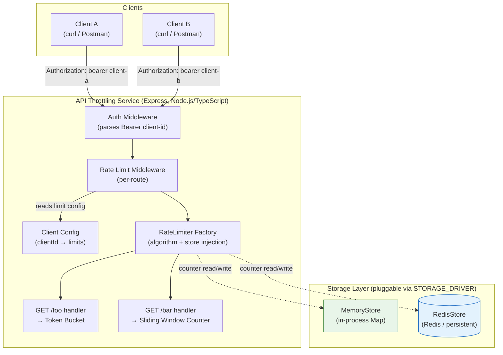
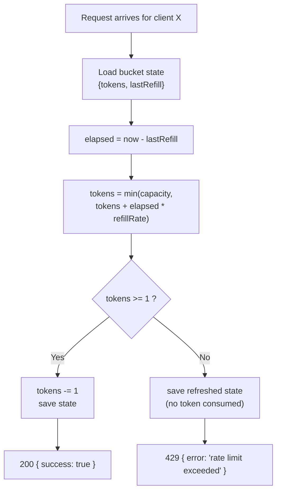
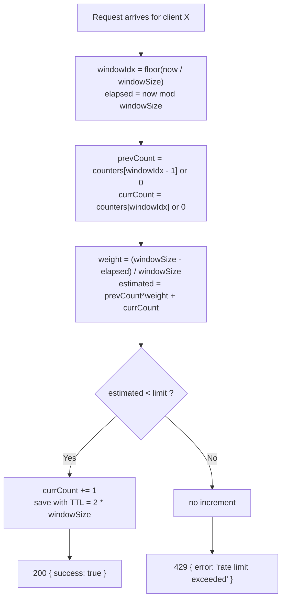
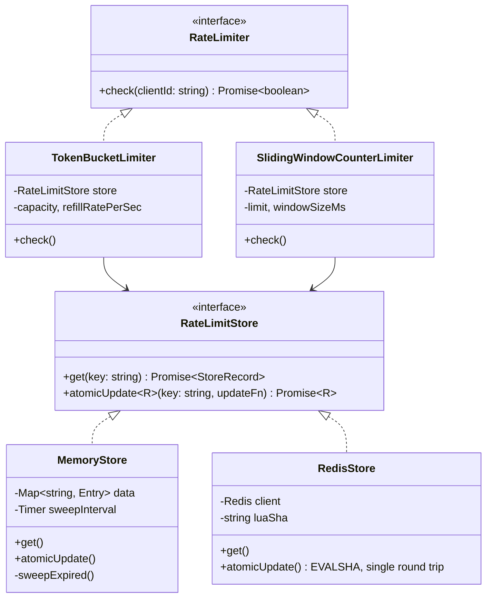
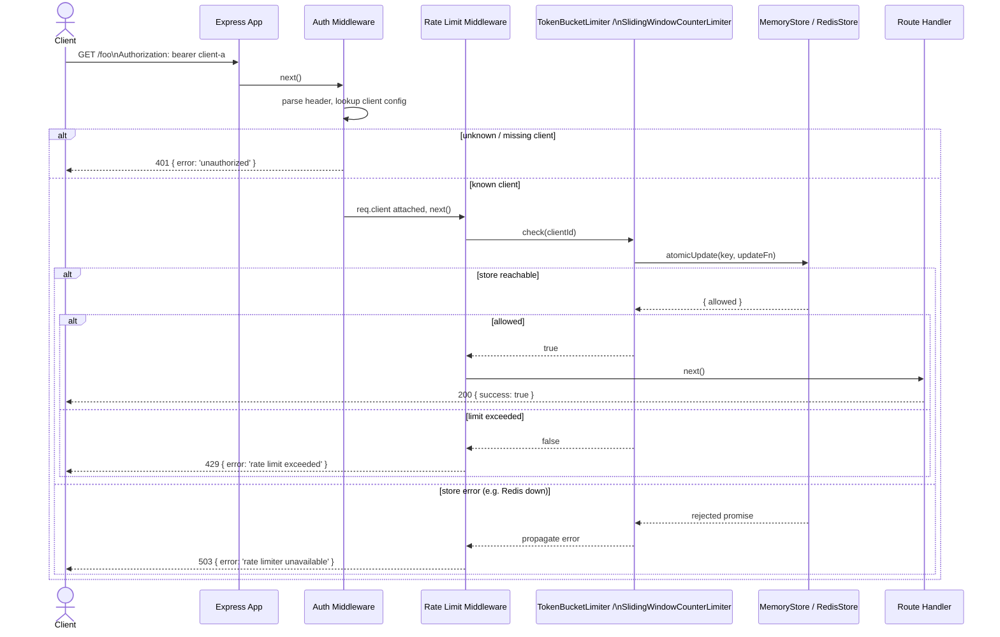
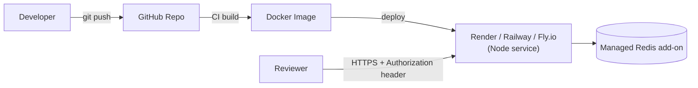

# API Throttling Service — Technical Architecture & Requirements Document

**Author:** Vicky Jadhav
**Status:** Draft for implementation

---

## 1. Overview

This document defines the architecture for a small HTTP API that demonstrates **API throttling (rate limiting)**. The service exposes two endpoints, `GET /foo` and `GET /bar`, each protected by a **different, self-implemented rate limiting algorithm**. Rate limits are enforced **per client**, where a client is identified by a bearer token in the `Authorization` header. The system supports two interchangeable **storage backends** for rate-limit counters — in-memory and persistent — selectable without changing endpoint logic.

### 1.1 Goals

- Demonstrate correct, from-scratch implementation of two distinct rate-limiting algorithms.
- Cleanly separate **algorithm**, **storage**, and **transport (HTTP)** concerns so storage/algorithm can be swapped independently.
- Support multiple clients with independently configurable limits.
- Be runnable locally with clear instructions, testable, and (stretch) deployable to a cloud provider.

### 1.2 Non-goals

- Distributed consensus / clock synchronization across multiple app instances (single-instance persistence is sufficient for the demo; the persistent store is chosen specifically so it *could* generalize to multi-instance).
- Full OAuth/JWT authentication — the task only requires a static client-ID bearer token lookup.
- Horizontal auto-scaling, observability stack, etc. — noted as future work only.

---

## 2. Requirements Traceability

| # | Requirement | Design Decision |
|---|---|---|
| R1 | Solution compiles; README has run instructions | TypeScript project with `npm run build` / `npm start`; documented in `README.md` |
| R2 | Any language/framework | Node.js 20 + TypeScript + Express (rationale in §4) |
| R3 | Rate limiting logic implemented from scratch | No `express-rate-limit` or similar libraries used for the core algorithms — only hand-rolled `Token Bucket` and `Sliding Window Counter` classes |
| R4 | Auth via `Authorization: bearer <client-id>` | `authMiddleware` parses header, resolves client config, rejects unknown clients with `401` |
| R5 | `/foo` and `/bar` use different algorithms | `/foo` → Token Bucket, `/bar` → Sliding Window Counter |
| R6 | 200 `{ success: true }` under limit | Shared response helper `sendSuccess()` |
| R7 | 429 `{ error: 'rate limit exceeded' }` over limit | Shared response helper `sendRateLimited()` |
| R8 | Per-client configurable limits | `config/clients.json` (or env) maps `clientId → { foo: {...}, bar: {...} }` |
| R9 | ≥2 clients with different limits | `client-a` (generous) and `client-b` (strict) preconfigured |
| R10 | 2 storage strategies: in-memory + persistent | `MemoryStore` (Map-based) and `RedisStore` (ioredis-based), both implementing a common `RateLimitStore` interface |
| R11 | Demonstrable for ≥2 clients, both endpoints, both storage strategies | `STORAGE_DRIVER=memory\|redis` env toggle; Postman collection / curl script in README covers all 2×2×2 combinations |
| R12 | ≥1 test | Jest + Supertest: unit tests for both algorithms, integration test for 429 behavior |
| R13 | (Stretch) Deployed to cloud | Dockerized; deployable to Render/Fly.io/Railway with managed Redis add-on |

---

## 3. High-Level Architecture



**Key design principle:** the HTTP layer, the rate-limit **algorithm**, and the **storage** are three orthogonal, independently swappable layers connected only through two small interfaces (`RateLimiter` and `RateLimitStore`). This is what lets `/foo` and `/bar` use different algorithms while both algorithms can run against either storage backend without modification.

---

## 4. Technology Stack

| Layer | Choice | Rationale |
|---|---|---|
| Language | TypeScript | Type safety for config/interfaces, compiles per R1, wide familiarity |
| Runtime | Node.js 20 | Lightweight, fast to bootstrap within the 4-hour budget |
| HTTP framework | Express 4 | Minimal, well-understood middleware model maps cleanly onto auth → rate-limit → handler pipeline |
| In-memory store | Native `Map` | Zero dependency, O(1) access, process-local |
| Persistent store | Redis (via `ioredis`) | Atomic counters (`INCR`, `MULTI`/Lua), native key TTL (perfect for window expiry), trivial to run locally via Docker and to provision on any cloud provider as a managed add-on |
| Testing | Jest + Supertest | Standard Node testing stack; Supertest drives real HTTP requests against the Express app in-memory |
| Containerization | Docker + docker-compose | `docker-compose.yml` bundles the app + a local Redis for one-command demo of both storage strategies |
| Deployment (stretch) | Render / Railway / Fly.io | All offer free-tier Node + managed Redis; simplest path to a public URL |

---

## 5. Authentication

All endpoints require:

```
Authorization: bearer <client-id>
```

`authMiddleware`:
1. Extracts the header, case-insensitively validates the `bearer` scheme.
2. Looks up `<client-id>` in the client registry (`config/clients.ts`).
3. If missing header, malformed scheme, or unknown client → `401 { error: 'unauthorized' }`.
4. On success, attaches `req.client = { id, limits }` for downstream middleware.

This is a **client identifier**, not a real credential — consistent with the task's intent (identify the caller for per-client throttling), not general-purpose auth/authorization.

---

## 6. Rate Limiting Algorithms

### 6.1 `/foo` — Token Bucket

**Why Token Bucket for `/foo`:** allows short controlled bursts up to the bucket capacity while enforcing a steady average refill rate — a good fit for a "burstable" endpoint.

**State per client:** `{ tokens: number, lastRefillTimestampMs: number }`

**Algorithm (executed atomically per request):**
1. Compute elapsed time since `lastRefillTimestampMs`.
2. Refill: `tokens = min(capacity, tokens + elapsed * refillRatePerMs)`.
3. If `tokens >= 1`: decrement by 1, persist state, **allow** (200).
4. Else: persist refreshed (but insufficient) state, **reject** (429).

> **Correctness note:** steps 1–4 must execute as a single atomic unit against the store (see §7) — the *decision* (allow/reject) and the *mutation* (writing the refilled/decremented token count) are computed together inside one `atomicUpdate` call. Computing the decision from a separate `get()` and then issuing a `set()` is a check-then-act race: two concurrent requests can both read `tokens = 1`, both decide "allow", and both decrement, letting the bucket go negative under load.
>
> `now()` is injected into `TokenBucketLimiter` as a constructor dependency (`() => number`, defaulting to `Date.now`) rather than called directly, so unit tests can advance a fake clock deterministically instead of using real `setTimeout` delays.



**Configurable parameters per client:** `capacity` (max burst), `refillRatePerSec` (sustained rate).

### 6.2 `/bar` — Sliding Window Counter

**Why Sliding Window Counter for `/bar`:** smooths out the "burst at window boundary" problem of a naive fixed window, without the memory cost of storing every request timestamp (as a full Sliding Window Log would) — a good contrast to Token Bucket's burst-friendly behavior, and cheap to implement atomically in Redis.

**State per client:** current fixed-window count + previous fixed-window count, held in **two separate store keys** (not one record) — see key naming in §7.

**Algorithm:**
1. `windowSizeMs` divides time into fixed windows; compute `currentWindowIndex = floor(now / windowSizeMs)` and the offset `elapsedInWindow = now % windowSizeMs`.
2. Plain `store.get(previousWindowKey)` → `previousCount` (defaults to 0 if absent/expired).
3. `store.atomicUpdate(currentWindowKey, ...)` where the update function receives `currentCount` (defaults to 0), computes the weighted estimate using `previousCount` from step 2, and — atomically in the same operation — decides allow/reject and increments only on allow:
   `estimated = previousCount * ((windowSizeMs - elapsedInWindow) / windowSizeMs) + currentCount`.
4. If `estimated < limit`: the update function returns `currentCount + 1` as the new state and `allowed = true`.
5. Else: the update function returns `currentCount` unchanged and `allowed = false`.

> **Why reading the previous window outside the atomic update is safe:** once `currentWindowIndex` advances past a window, that window's key is **never written again** — it is a closed, immutable value from that point on. The only key that needs read+decide+write atomicity is the *current* window's key, which step 3 handles. This lets the limiter avoid a multi-key transaction while still being race-free.



**Configurable parameters per client:** `limit` (max requests per window), `windowSizeMs`.

### 6.3 Comparison

| | Token Bucket (`/foo`) | Sliding Window Counter (`/bar`) |
|---|---|---|
| Burst tolerance | High (up to bucket capacity) | Low (smoothed) |
| Boundary fairness | N/A (continuous refill) | Corrects fixed-window edge burst |
| Memory per client | 2 numbers | 2 numbers (current + previous window) |
| Storage ops per request | 1 read + 1 write | 2 reads + ≤1 write |

---

## 7. Storage Layer



### 7.1 The `atomicUpdate` contract

```ts
type StoreRecord = Record<string, number>; // shape is algorithm-defined, e.g. {tokens, lastRefillTs} or {count}

interface UpdateResult<R> {
  next: StoreRecord | null; // null = do not persist (e.g. TTL-only touch not needed)
  ttlMs?: number;           // key expiry, set/refreshed on every write
  result: R;                // whatever the caller needs back — typically { allowed: boolean }
}

interface RateLimitStore {
  get(key: string): Promise<StoreRecord | null>;
  atomicUpdate<R>(
    key: string,
    updateFn: (current: StoreRecord | null, now: number) => UpdateResult<R>
  ): Promise<R>;
}
```

`atomicUpdate` is the **only** way limiters write state. `updateFn` is pure and synchronous: given the current record (or `null` if absent/expired) and the current time, it returns the next record **and** the caller-facing result (e.g. `{ allowed: true }`) in one shot. This is what closes the check-then-act race described in §6.1/§6.2 — the store guarantees `updateFn` runs against a consistent snapshot with no other writer interleaved, and the decision travels back out with the mutation instead of being re-derived from a separate read.

- **`MemoryStore`**: backed by a plain `Map<string, Entry>`. Because `updateFn` is synchronous and JavaScript's event loop never preempts a synchronous block, `get → updateFn → set` inside `atomicUpdate` cannot be interleaved by another request — **no mutex is needed**. What *is* needed: the Sliding Window Counter mints a new key per window index forever, so `MemoryStore` must (a) lazily treat an entry as absent once `now > expiresAt` on read, and (b) run a periodic sweep (e.g. every 60s, via `setInterval`) that deletes expired entries outright — lazy expiry alone leaves memory pinned for keys nobody ever reads again. Lost on process restart — expected for the "in-memory" strategy by definition.
- **`RedisStore`**: `updateFn`'s logic is re-expressed as a Lua script and executed with `EVALSHA`, so the read-modify-write happens atomically **inside Redis**, in one round trip, immune to interleaving from other app instances. Relies on Redis key **TTL** (`ttlMs` from `UpdateResult`) to auto-expire stale window/bucket state instead of manual cleanup. Survives process restarts and generalizes to multiple app instances sharing one Redis.
- Both stores implement the identical `RateLimitStore` interface, so `TokenBucketLimiter` and `SlidingWindowCounterLimiter` are written once and are storage-agnostic.
- Selected at startup via `STORAGE_DRIVER=memory|redis` env var (factory in `src/storage/index.ts`), no code change needed to switch.

**Key naming convention:**
- Token Bucket (single evolving record per client+route): `ratelimit:token-bucket:{clientId}:{route}` — e.g. `ratelimit:token-bucket:client-a:foo`.
- Sliding Window Counter (one immutable record per client+route+window): `ratelimit:sliding-window:{clientId}:{route}:{windowIndex}` — e.g. `ratelimit:sliding-window:client-a:bar:172839`. The limiter reads `...:172838` (previous) with a plain `get`, and atomically updates `...:172839` (current).

### 7.2 Failure mode: Redis unavailable

When `STORAGE_DRIVER=redis` and the Redis connection is down, `RedisStore.atomicUpdate` rejects. The middleware treats this as **fail-closed**: it returns `503 { error: 'rate limiter unavailable' }` rather than silently letting requests through. For a service whose entire purpose is enforcing a limit, failing open would defeat the feature under exactly the conditions (backend stress/outage) where throttling matters most; a 503 also gives the caller an unambiguous signal to retry rather than a misleading 200 or an inaccurate 429.

---

## 8. Request Flow (Sequence Diagram)



---

## 9. Configuration

`config/clients.json` (loaded at startup, could be env-driven for production):

```json
{
  "client-a": {
    "foo": { "capacity": 10, "refillRatePerSec": 1 },
    "bar": { "limit": 5, "windowSizeMs": 10000 }
  },
  "client-b": {
    "foo": { "capacity": 3, "refillRatePerSec": 0.2 },
    "bar": { "limit": 20, "windowSizeMs": 10000 }
  }
}
```

This directly satisfies R8/R9: two clients, each with independently tunable limits per endpoint.

Environment variables (`.env`):

| Var | Purpose | Default |
|---|---|---|
| `PORT` | HTTP port | `3000` |
| `STORAGE_DRIVER` | `memory` \| `redis` | `memory` |
| `REDIS_URL` | Redis connection string (when `STORAGE_DRIVER=redis`) | `redis://localhost:6379` |

---

## 10. Project Structure

```
api-throttling-service/
├── src/
│   ├── index.ts                  # app bootstrap, storage driver selection
│   ├── config/
│   │   ├── clients.ts            # loads & types clients.json
│   │   └── clients.json
│   ├── middleware/
│   │   ├── auth.ts               # Authorization header parsing
│   │   └── rateLimit.ts          # generic middleware, delegates to a RateLimiter
│   ├── limiters/
│   │   ├── RateLimiter.ts        # interface
│   │   ├── TokenBucketLimiter.ts
│   │   └── SlidingWindowCounterLimiter.ts
│   ├── storage/
│   │   ├── RateLimitStore.ts     # interface
│   │   ├── MemoryStore.ts
│   │   ├── RedisStore.ts
│   │   └── index.ts              # factory, reads STORAGE_DRIVER
│   ├── routes/
│   │   ├── foo.ts
│   │   └── bar.ts
│   └── utils/
│       └── respond.ts            # sendSuccess / sendRateLimited helpers
├── test/
│   ├── tokenBucket.unit.test.ts
│   ├── slidingWindow.unit.test.ts
│   └── endpoints.integration.test.ts
├── Dockerfile
├── docker-compose.yml            # app + redis, for local persistent-storage demo
├── .env.example
├── package.json
├── tsconfig.json
└── README.md
```

---

## 11. API Contract

### `GET /foo`
- Headers: `Authorization: bearer <client-id>` (required)
- Algorithm: Token Bucket
- **200 OK** → `{ "success": true }`
- **401 Unauthorized** → `{ "error": "unauthorized" }`
- **429 Too Many Requests** → `{ "error": "rate limit exceeded" }`
- **503 Service Unavailable** → `{ "error": "rate limiter unavailable" }` (only under `STORAGE_DRIVER=redis`, when Redis is unreachable — see §7.2)

### `GET /bar`
- Headers: `Authorization: bearer <client-id>` (required)
- Algorithm: Sliding Window Counter
- Same response contract as `/foo`.

Optional debug headers on every response (nice-to-have, not required): `X-RateLimit-Limit`, `X-RateLimit-Remaining`, `X-RateLimit-Algorithm` — useful when demonstrating the two algorithms behave differently under the same burst pattern.

---

## 12. Testing Strategy

| Test | Type | What it proves |
|---|---|---|
| `TokenBucketLimiter` allows burst up to capacity, then throttles | Unit (fake clock) | Core algorithm correctness, independent of HTTP/storage |
| `SlidingWindowCounterLimiter` throttles at boundary correctly (weighted estimate) | Unit (fake clock) | Core algorithm correctness |
| `GET /foo` returns 200 then 429 after exceeding `client-b`'s low capacity | Integration (Supertest) | End-to-end wiring: auth → middleware → limiter → response codes |
| `GET /bar` behaves independently per client (client-a not affected by client-b's usage) | Integration | Per-client isolation (R8/R9) |
| Fire N concurrent requests (`Promise.all`) at a client whose capacity is exactly N-1 | Unit, both stores | Proves `atomicUpdate` prevents the check-then-act race from §6.1 — exactly `capacity` requests succeed, not more, even when issued simultaneously |
| Same suite run with `STORAGE_DRIVER=memory` and `STORAGE_DRIVER=redis` (CI matrix or two npm scripts) | Integration | Storage-strategy interchangeability (R10/R11) |

Satisfies R12 (≥1 test) with meaningful margin; run via `npm test`.

---

## 13. Demo Plan (satisfies R11)

A `demo/requests.http` (or Postman collection) walks through all combinations:

1. Start with `STORAGE_DRIVER=memory`.
   - `client-a` hits `/foo` repeatedly → observe burst allowed, then steady 1 req/sec.
   - `client-b` hits `/foo` repeatedly → observe much smaller burst before 429.
   - `client-a` and `client-b` hit `/bar` → observe independent sliding-window counts.
2. Restart with `STORAGE_DRIVER=redis` (`docker-compose up`) → repeat the same sequence, additionally showing that killing and restarting the **app** process (not Redis) preserves counters, unlike the memory driver.

---

## 14. Deployment (Stretch Goal)



- `Dockerfile` builds the compiled TS app; `docker-compose.yml` is for local dev only.
- Cloud platform provides `REDIS_URL` and `PORT` as env vars automatically; `STORAGE_DRIVER=redis` in production.
- Public URL + example curl commands (with both client IDs) included in the README for the reviewer to test directly.

---

## 15. Assumptions

- Single app instance for the `memory` driver — `MemoryStore` state is process-local by design and is never expected to be shared or consistent across instances; horizontal scaling requires `STORAGE_DRIVER=redis`.
- Redis is reachable before the app finishes startup when `STORAGE_DRIVER=redis`; the app fails fast (crashes on boot) rather than starting in a half-ready state, per §7.2's fail-closed stance applied at startup too.
- `config/clients.json` is static and loaded once at process start — no hot-reload of client limits. Adding a client or changing a limit requires a restart, which is acceptable for the scope of this task.
- The server's system clock is trusted and monotonic enough for `refillRatePerMs`/window-boundary math over the short intervals this demo exercises; no NTP-skew handling is implemented.
- `bearer` scheme matching is case-insensitive (`Bearer`, `bearer`, `BEARER` all accepted) since the task's own example uses lowercase, which is non-standard relative to RFC 6750's `Bearer`.

---

## 16. Risks & Trade-offs

| Risk | Mitigation |
|---|---|
| Sliding Window Counter keys accumulate in `MemoryStore` forever (one per window index) | Lazy expiry on `get` + periodic sweep (§7.1) reclaims memory for keys nobody reads again |
| Redis round-trip latency adds overhead per request | Lua script (`EVALSHA`) keeps each check to a single round trip regardless of how many fields the algorithm's state has |
| Clock drift affecting Token Bucket refill math | Use monotonic `Date.now()` consistently server-side only, via the injected `now()` dependency (§6.1); not a concern for a single-process/single-Redis demo |
| Redis outage stalls all `/foo` and `/bar` traffic under `STORAGE_DRIVER=redis` | Deliberate fail-closed 503 (§7.2) — correct behavior for a rate limiter, called out explicitly so it isn't mistaken for a bug during review |
| Scope creep beyond 4-hour budget | Keep auth to bearer-token lookup only; skip persistence for client config (JSON file is enough); skip rate-limit response headers unless time remains |
